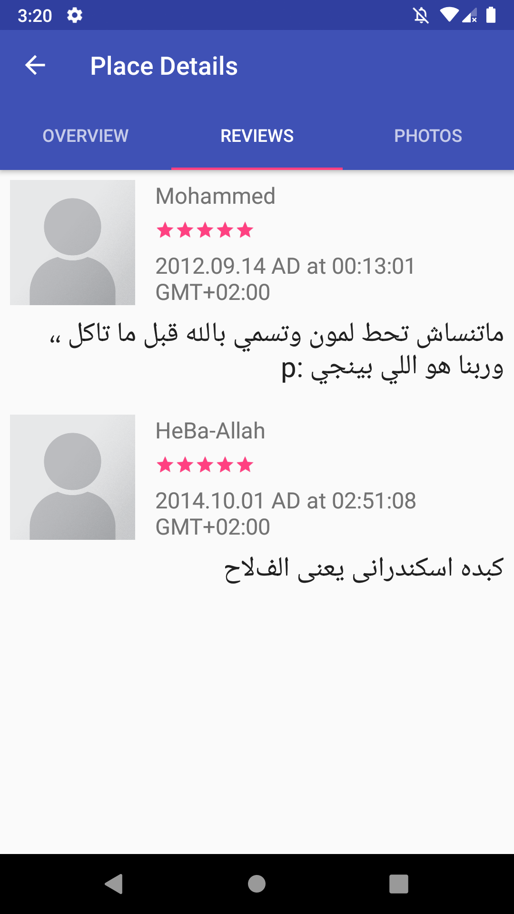
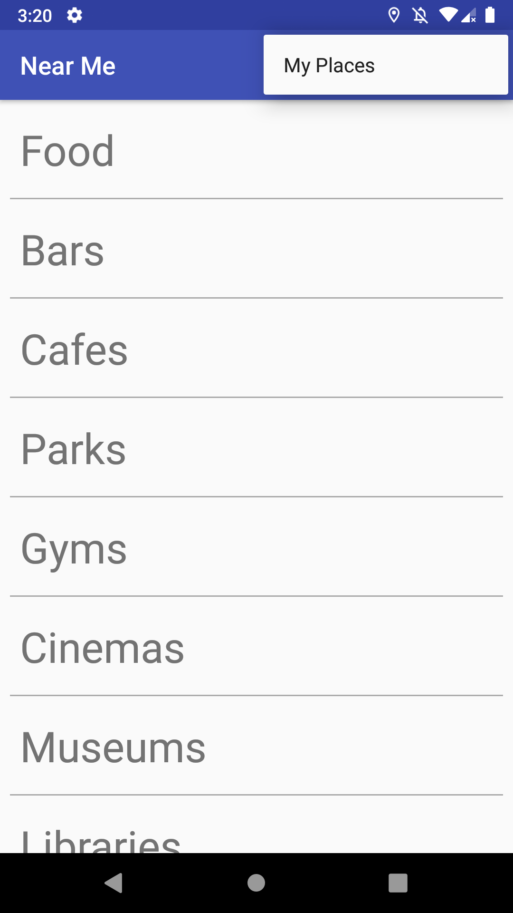

# Near-Me-App

App Shows nearby places of the user location using [foursquare Api](https://foursquare.com/).

## Features

- Get and Update user location using **the location APIs in google play services**
- Fetch places nearby user location through network using **httpURLConnection**
- Preview data by using **Recycler view**
- Handle Images download and store by **Picasso**
- Store user favorite places in locale database using **SQLiteOpenHelper** with **SQLite**
- Use **Content Provider** as access layer to the database

## Usage Library

- [Picasso](https://square.github.io/picasso/)
- [Butter Knife](http://jakewharton.github.io/butterknife/)
- [SQLite](https://www.sqlite.org/index.html)

## Screenshots

